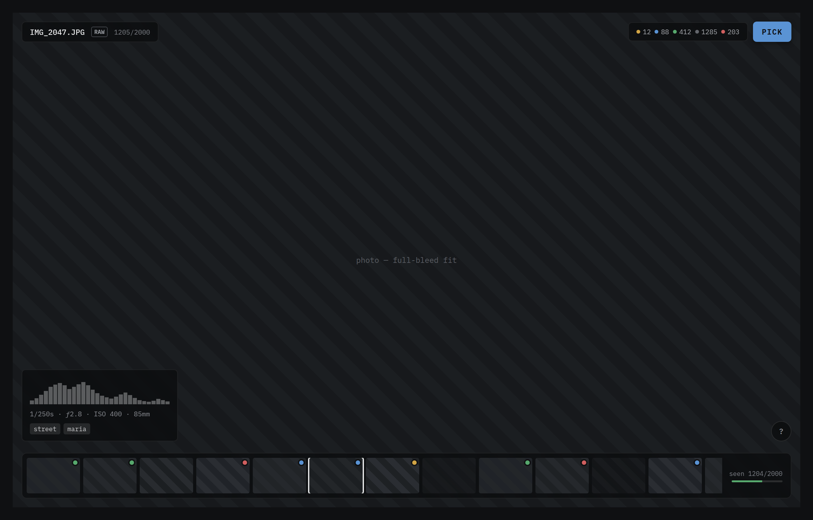
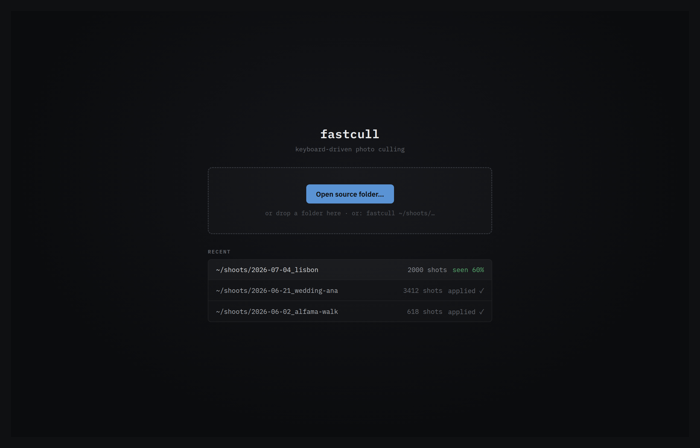
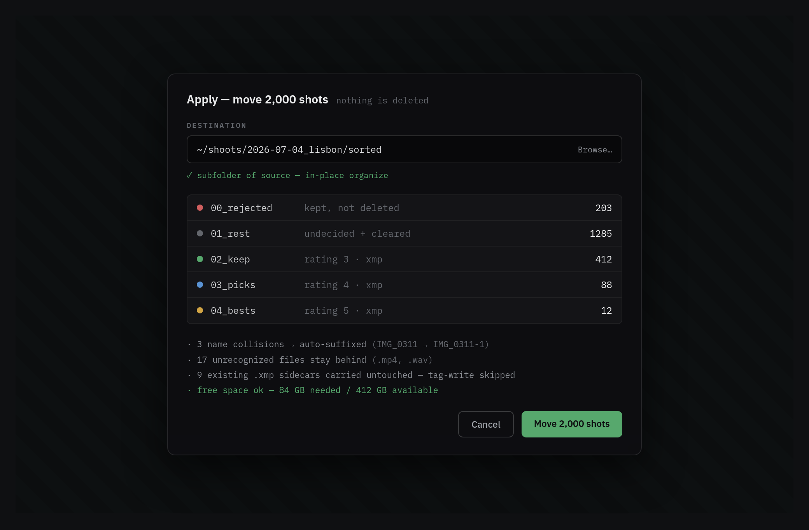
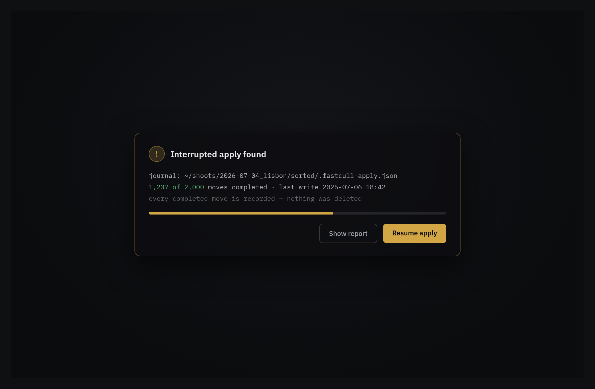
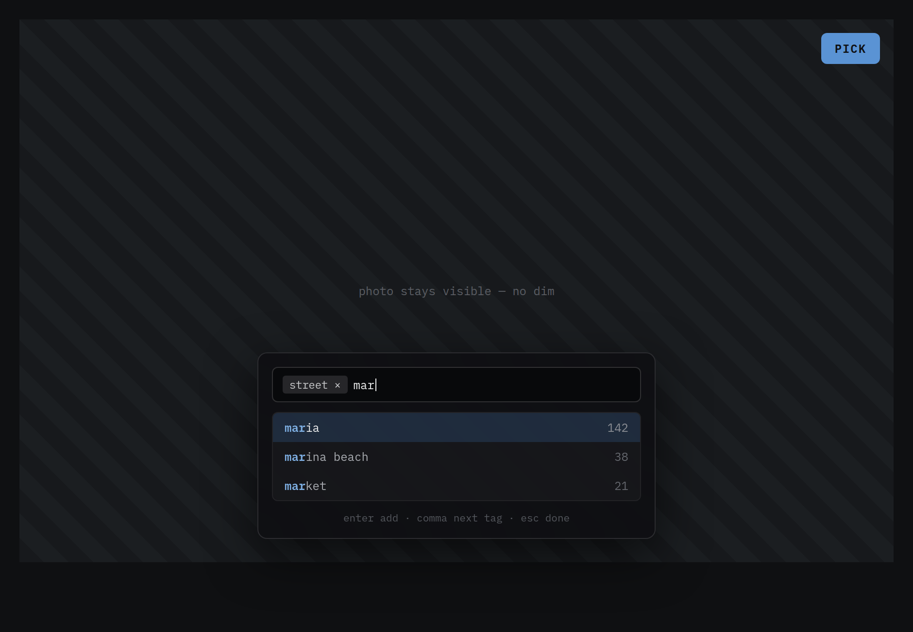

# FastCull

**Fast, keyboard-driven photo culling for Linux.** Point it at a folder of
shots, race through them with single keypresses to sort each into a quality tier
(and optionally tag them), then on **Apply** it safely reorganizes everything
into a clean destination-folder structure.

[](https://github.com/shellkah/fastcull/actions/workflows/ci.yml)
[](https://github.com/shellkah/fastcull/releases/latest)
[](LICENSE)
[](#platform)



## What it is

FastCull occupies the same niche as **Photo Mechanic** / **FastRawViewer**: the
*culling* step that happens **before** serious editing — done fast, with the
keyboard, on large shoots. You blast through thousands of frames, tier each one
with a single key, and let FastCull do the organizing. It is deliberately **not**
an editor.

Its defining trait is **safety**: nothing touches disk until you press Apply,
your decisions survive across sessions, and **v1 never deletes anything** —
every operation is a verified move, and a crash mid-Apply is recoverable from a
journal.

## Features

- **Single-key tiering** — Keep / Pick / Best / Reject, or leave in the residual
  *Rest*. Auto-advance keeps you moving (toggle off with `--no-auto-advance`).
- **RAW + JPEG as one shot** — the RAW sibling travels with its JPEG; a Fuji
  **`.RAF`** with no JPEG is shown via its embedded preview.
- **Non-destructive & resumable** — decisions live in a session sidecar; close
  and reopen and you pick up exactly where you left off.
- **Crash-safe Apply** — moves are journaled; an interrupted Apply is detected on
  next launch and offered for resume.
- **Free-form tags** — comma-separated, with autocomplete, written as XMP.
- **Loupe & histogram HUD** — zoom to 1:1, EXIF line, luma histogram.
- **Writes standard sidecars** — `dc:subject` keywords + `xmp:Rating`, readable
  by Lightroom / darktable / Bridge.

## Screenshots

| Startup / folder pick | Apply dialog | Crash recovery | Tag entry |
|---|---|---|---|
|  |  |  |  |

## Install

### Download a release

Grab the tarball for your architecture from the
[latest release](https://github.com/shellkah/fastcull/releases/latest):

```sh
tar xzf fastcull-vX.Y.Z-x86_64-linux.tar.gz    # or -aarch64-linux
./fastcull-vX.Y.Z-x86_64-linux/fastcull --help
```

The binary statically links Skia; at runtime it needs only **libjpeg-turbo** and
**fontconfig**, present on virtually every desktop Linux (install explicitly if
missing):

```sh
sudo apt install libturbojpeg0 libfontconfig1
```

### Build from source

Requires **Rust 1.85+** (2024 edition) and these system packages:

```sh
sudo apt install -y pkg-config libturbojpeg0-dev libfontconfig1-dev \
  clang libclang-dev libxkbcommon-dev libwayland-dev libx11-dev libxcb1-dev
cargo build --release          # binary at target/release/fastcull
```

> `culler-core` links the system **libjpeg-turbo** through `pkg-config` (the
> legacy TurboJPEG API); it targets libjpeg-turbo 2.1.x. See the note in
> `culler-core/Cargo.toml` for why the `turbojpeg` crate is pinned.

## Usage

```sh
fastcull /path/to/shoot   # open a folder directly
fastcull                  # no arg → startup screen, pick a folder interactively
```

The source folder is scanned **flat** (non-recursive). Work through the shots,
then press **`A`** to Apply — files are *moved* into per-tier bucket folders
under a destination you choose, with tags + rating written as XMP sidecars.

### Keys

| Key | Action | Key | Action |
|---|---|---|---|
| `→` / `Space` | Next shot | `1` | Keep |
| `←` / `Backspace` | Previous shot | `2` | Pick |
| `Tab` | Next unvisited | `3` | Best |
| `Z` | Zoom / loupe | `X` | Reject |
| `R` | Toggle RAW / JPEG preview | `` ` `` / `0` | Rest (clear tier) |
| `F` | Cycle filter | `U` | Undo last decision |
| `Return` | Toggle loupe focus | `T` | Add tags |
| `F11` | Fullscreen | `A` | **Apply** |
| `?` | Key sheet / help | `Ctrl`+`S` | Force-save session |

### Destination layout

| Tier | Key | Bucket folder | XMP rating |
|---|---|---|---|
| Best | `3` | `04_bests` | 5 |
| Pick | `2` | `03_picks` | 4 |
| Keep | `1` | `02_keep` | 3 |
| Rest | `` ` `` / `0` | `01_rest` | — |
| Reject | `X` | `00_rejected` | −1 |

Rename any bucket with `--bucket-rejected`, `--bucket-rest`, `--bucket-keep`,
`--bucket-picks`, `--bucket-bests`.

## Platform

**Linux-only, by design.** FastCull is a focused personal tool: it renders with
Slint/Skia, uses the XDG desktop portal for folder picking, and links the system
libjpeg-turbo. Cross-platform packaging is an explicit non-goal. Releases are
built natively for `x86_64` and `aarch64`.

## Development

```sh
cargo test --workspace        # 292 tests
cargo clippy --workspace --all-targets -- -D warnings
cargo fmt --all -- --check
```

Two crates: **`culler-core`** (scan, EXIF/XMP, JPEG/RAW decode, plan + apply
engine, persistence) and **`culler`** (the Slint GUI + CLI, which builds the
`fastcull` binary). Design docs live in
[`docs/`](docs/) — start with
[`docs/specs/2026-07-08-fastcull-design.md`](docs/specs/2026-07-08-fastcull-design.md).

## License

[MIT](LICENSE) © 2026 Yoann (shellkah)
